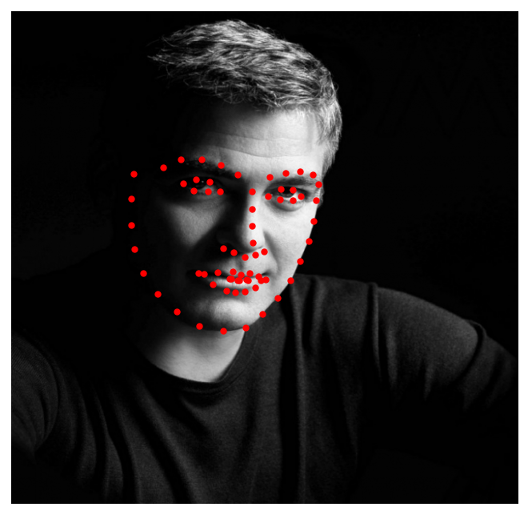
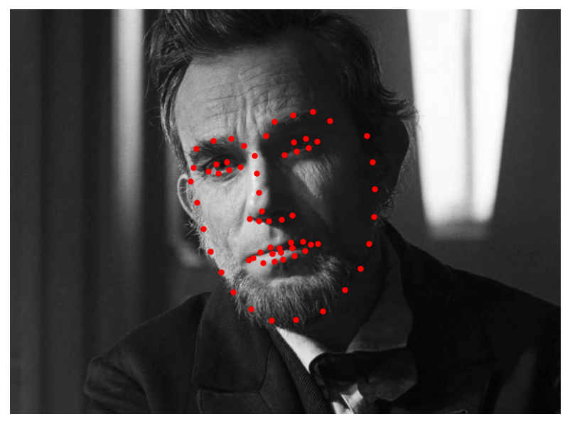
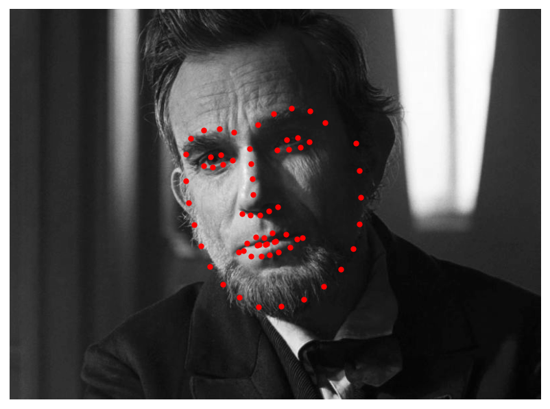
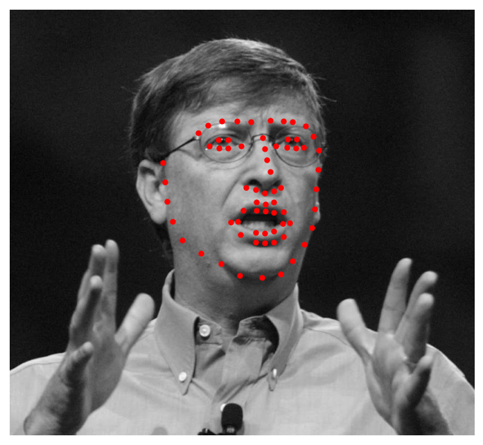
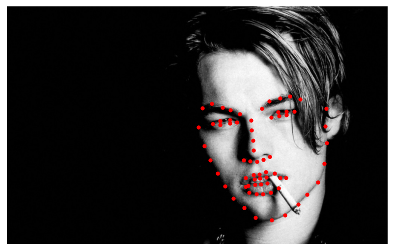
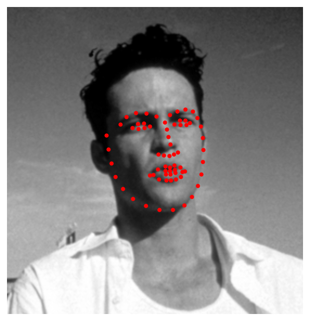
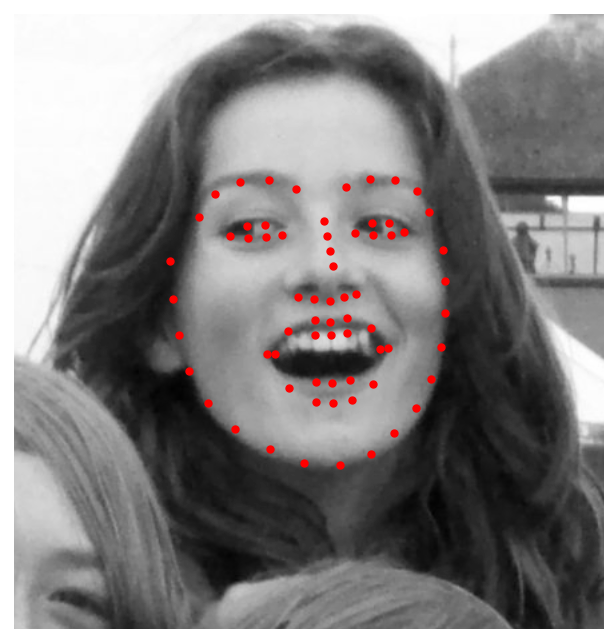
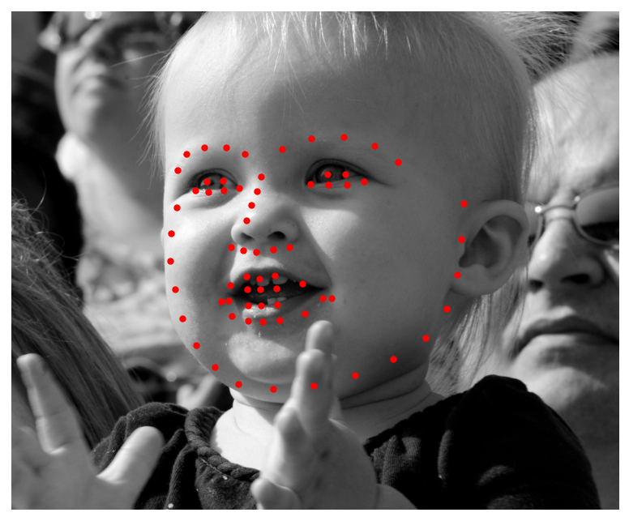
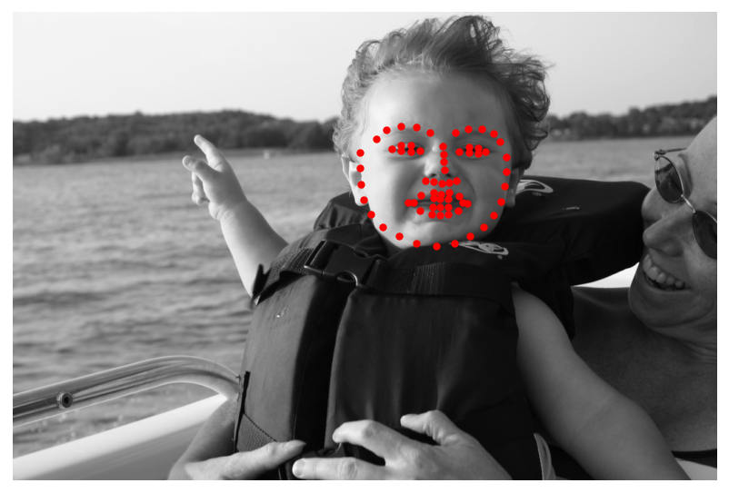
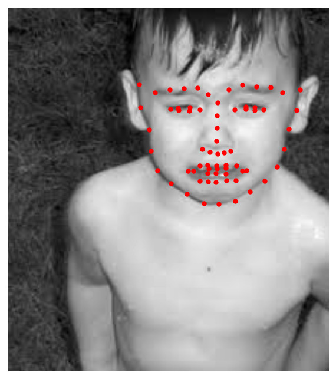

# Shape Constrained Network

This repository contains my implementation of a shape-constrained network.

The measured inference performance is up to 170 FPS on a 1080Ti. 
These results have been achieved with images already loaded into RAM and 
forwarding only one single image through the network at the same time (batchsize = 1)

## Content
- [Results](#results)
  - [Indoor](#indoor)
  - [Outdoor](#outdoor)
- [Installation](#installation)
- [Usage](#usage)
  - [Prediction](#prediction)
  - [Training](#training)
- [Requirements](#requirements)

## Results

The given Results are obtained by training the network on [HELEN](http://www.ifp.illinois.edu/~vuongle2/helen/), 
validating it on [LFPW](https://neerajkumar.org/databases/lfpw/) and predicting samples from [300W](https://ibug.doc.ic.ac.uk/resources/300-W/).

For consistency of the annotated landmarks the landmarks for all datasets have been downloaded from [ibug](https://ibug.doc.ic.ac.uk/resources/facial-point-annotations/).

The following images show that the network can deal with indoor images as well as with outdoor images.
Despite relatively easy frontal headposes also images containing people with beards, glasses and other 
small occlusions like cigarettes and images with a high variety of facial expressions can be successfully 
predicted. 
Even images containing small children or babies, which are typically hard for stochastically constrained models (like AAMs)
yield acceptable results.


The pretrained model with it's configuration file is provided [here](https://drive.google.com/open?id=15nA0wEKoaDfDInEXwGBxDnVLD6bPX_i_)

### Indoor

#### Frontal Pose

|Groundtruth|Prediction|
|:---------:|:--------:|
| | |

#### Frontal Pose + Beard

|Groundtruth|Prediction|
|:---------:|:--------:|
| | |

#### Small occlusions (Glasses, Hair, Cigarettes etc.)
|Groundtruth|Prediction|
|:---------:|:--------:|
| | |
| | |


### Outdoor
#### Frontal Pose
|Groundtruth|Prediction|
|:---------:|:--------:|
| | |


#### Facial Expressions (Open Mound etc.)
|Groundtruth|Prediction|
|:---------:|:--------:|
| | |


#### Baby and Child Faces
|Groundtruth|Prediction|
|:---------:|:--------:|
| | |
| | |
| | |


## Installation
To Install the necessary environment follow these steps:

1. `git clone https://github.com/justusschock/shape-constrained-network.git`
2. `cd shape-constrained-network`
3. Install the requirements listed below, use the provided [Dockerfile](docker/Dockerfile) or the [prebuilt docker image](https://hub.docker.com/r/justusschock/shape-constrained-network/)
4. `python setup.py install`

## Usage
### Prediction
With a config file containing the arguments  `num_shape_params`, `num_global_params`,
  `num_translation_params`, `num_pts`, `norm` and `img_size`you can get a prediction-ready Network by calling
 ```python
shapenet.get_shapenet_from_files("PATH/TO/CONFIG/FILE", 
                                 "PATH/TO/WEIGHT/FILE", 
                                 user="CONFIG_USER")

```

You may also add other keyword arguments which are directly passed to `torch.load()`
as `map_location="cpu"` if you want to load on a CPU-only machine.

> **Note:** Since there are many different and well working face detectors, this implementation
> assumes that a face detection is performed to extract a RoI and feeding only this RoI to the Network.

### Training
The Hyperparameters are usually parsed from a YAML-file like this:

```YAML
default:
  pca_data_path: "PATH/TO/DATA"
  network_train_path: "PATH/TO/DATA"
  validation_path: "PATH/TO/DATA"
  network_type: "EXPERIMENT_NAME"
  output_path: "PATH/TO/OUTPUT/DIR"
  verbose: True
  img_size: 224 # currently only image size 224 implemented
  initial_lr: 1e-4
  num_epochs: 75
  num_shape_params: 25
  num_global_params: 1
  num_translation_params: 2
  num_pts: 2
  scale: True
  center: True
  norm: "instance"
  batch_size: 1
  use_cpp: False # very experimental C++ implementation
```

Using a parser like 

```python
import argparse
import sys
import os

parser = argparse.ArgumentParser(description="Select User and Configuration file")
    parser.add_argument("-u", "--user", help="Select User", dest="user", type=str, default="default")
    parser.add_argument("-f", "--config_file", help="Select Configuration file", dest="config_file", type=str,
                        default="./config.yaml")

    yaml_file_path = os.path.join(os.path.split(os.path.realpath(__file__))[0], "config.yaml")

    parse_args = sys.argv[1:] if len(sys.argv) > 1 else ["-u", "default", "-f", yaml_file_path]
    parsed_args = parser.parse_args(parse_args)
```

you can parse the file and the user either from command line or use the default ones.

```python
from shapenet import NetConfig
config = NetConfig(parsed_args.config_file, parsed_args.user)
```
will then parse the parameters from your specified config-file and user.

After parsing your params, you can create a network with

```python
from shapenet import DataProcessing, ShapeNetwork


eigen_shapes = DataProcessing.from_menpo(config.pca_data_path).lmk_pca(config.scale, config.center,
                                                                           n_components=config.num_shape_params)

model = ShapeNetwork(eigen_shapes, config.num_shape_params, config.num_global_params,
                         config.num_translation_params, config.img_size,
                         norm_type=config.norm, use_cpp=config.use_cpp)
```
and start training with 
```python
import torch
import os
import shutil
from torchvision.transforms import Compose, ToTensor, Normalize
from shapenet import train
from datetime import datetime

optimizer = torch.optim.Adam(model.parameters(), lr=float(config.initial_lr))

out_path = os.path.join(config.output_path, config.network_type, str(datetime.now().strftime("%y-%m-%d_%H-%M-%S")))
os.makedirs(out_path, exist_ok=True)
shutil.copy2(parsed_args.config_file, out_path)

transformations = {"train": Compose([ToTensor(), Normalize([0], [1])]),
                   "validate": Compose([ToTensor(), Normalize([0], [1])])
                   }

train(
    config.network_train_path,
    config.validation_path,
    config.num_epochs,
    out_path,
    torch.nn.MSELoss(),
    model,
    optimizer,
    config.batch_size,
    config.verbose,
    float(config.initial_lr),
    transformations=transformations,
    save_outputs=False
    )
```
## Requirements
* [menpo](https://www.menpo.org/installation/) (v. 0.7.7 is recommended)
* [PyTorch and Torchvision](https://pytorch.org/)
* [scikit-image](https://scikit-image.org/)
* [scikit-learn](http://scikit-learn.org/stable/)
* [tqdm](https://github.com/tqdm/tqdm)
* [PyYAML](https://pyyaml.org/)
* [tensorboardX](https://github.com/lanpa/tensorboardX)
